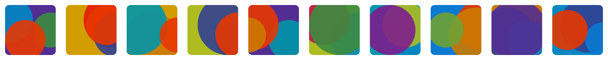

# Picasso

[](https://badge.fury.io/js/%40vechain%2Fpicasso)

General purpose deterministic identity icon library in svg format, mostly for vechain thor addresses.



## Install

## By CDN

Picasso is available at [jsDelivr](https://www.jsdelivr.com/package/npm/@vechain/picasso), you can import it directly.

``` html
<script src="https://cdn.jsdelivr.net/npm/@vechain/picasso"></script>
```

## By NPM

``` bash
# NPM
npm install --save @vechain/picasso

# Yarn
yarn add @vechain/picasso
```

## Usage

``` javascript
import { picasso } from '@vechain/picasso' // not required if imported from script tag

const div = document.createElement("div")
const svg = picasso('0xf6e78a5584c06e2dec5c675d357f050a5402a730')
div.style.background = `no-repeat url('data:image/svg+xml;utf8,${svg}')`
div.style.height = '200px' 
div.style.width = '200px' 

document.body.appendChild(div);
```


## License

picasso is licensed under the [GNU Lesser General Public License v3.0](https://www.gnu.org/licenses/lgpl-3.0.html), also included in *LICENSE* file in repository.
